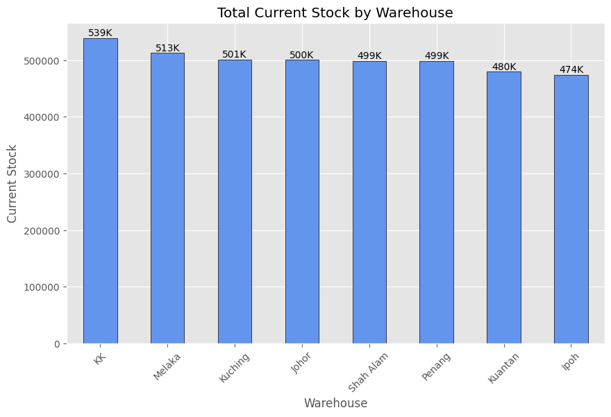
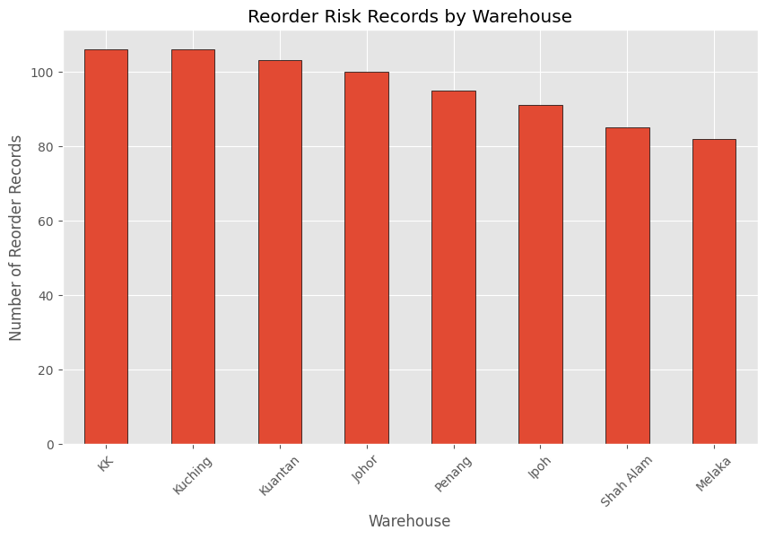
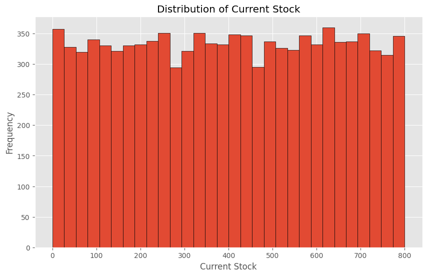

# RetailMart Inventory Analysis

> End-to-end Inventory Analytics project using **Python, Pandas, and Matplotlib** to identify inventory shortages, reorder risks, and provide data-driven business recommendations.

---

## Project Overview

RetailMart Malaysia is experiencing inventory management challenges across multiple warehouses, resulting in stock shortages and inefficient replenishment planning.

This project simulates a real-world inventory analytics workflow by cleaning and analysing inventory data to identify products requiring immediate replenishment, evaluate warehouse performance, and generate actionable business insights.

---

## Business Objectives

This project aims to answer the following business questions:

- Which warehouse stores the highest inventory?
- Which warehouses have the highest reorder risk?
- Which products require immediate replenishment?
- Which product categories contribute the most to inventory shortages?
- Which categories experience the highest average inventory shortage?
- What recommendations can improve inventory planning?

---

## Dataset

This project uses a simulated retail inventory database consisting of approximately **10,000 inventory records** across **1,000 unique products**.

### Tables

| Dataset | Description |
|---------|-------------|
| retail_store_inventory.csv | Inventory records across multiple warehouses |
| products.csv | Product information |
| warehouses.csv | Warehouse master data |
| suppliers.csv | Supplier information |
| purchase_orders.csv | Purchase order records |
| sales.csv | Sales transactions |

---

# Project Workflow

```
Business Understanding
        │
        ▼
Data Cleaning
        │
        ▼
Data Validation
        │
        ▼
Exploratory Data Analysis (EDA)
        │
        ▼
Business Questions
        │
        ▼
Business Insights
        │
        ▼
Recommendations
```

---

# Tech Stack

- Python
- Pandas
- NumPy
- Matplotlib
- Jupyter Notebook
- VS Code
- Git
- GitHub

---

# Project Preview

## 1. Warehouse Inventory Distribution



---

## 2. Warehouse Reorder Risk



---

## 3. Distribution of Current Stock



---

## 4. Top 10 Products Requiring Immediate Replenishment


---

# Key Findings

### Inventory Overview

- Analysed **10,000 inventory records**
- Covered **1,000 unique products**
- Average inventory level: **400 units**

---

### Reorder Analysis

- **768 inventory records** require replenishment.
- **533 unique SKUs** are currently below the reorder level.
- KK and Kuching recorded the highest number of reorder-risk products.

---

### Category Analysis

The Home category recorded the highest total inventory shortage.

However, after normalising using the **average reorder gap**, the Pet category showed the most severe shortage per reorder record.

This demonstrates the importance of analysing multiple metrics instead of relying solely on total values.

---

### Priority Products

The project identified the Top 10 products with the highest inventory shortage based on the Reorder Gap metric.

These products should be prioritised to minimise stockout risk and avoid potential revenue loss.

---

# Business Recommendations

- Prioritise products with the highest Reorder Gap.
- Monitor categories with high average shortages rather than relying only on total shortages.
- Implement automated inventory alerts before products fall below their reorder level.
- Review warehouse replenishment strategies for high-risk warehouses.
- Regularly monitor inventory KPIs using dashboards.

---

# Skills Demonstrated

### Data Analytics

- Data Cleaning
- Data Validation
- Exploratory Data Analysis (EDA)
- Feature Engineering
- Business Analysis
- Root Cause Analysis

### Python

- Pandas
- NumPy
- Matplotlib

### Business

- Inventory Analytics
- KPI Analysis
- Business Storytelling
- Data-driven Decision Making

---

# Repository Structure

```
RetailMart-Inventory-Analysis/

├── data/
│
├── images/
│   ├── distribution_curr_stock.png
│   ├── reorder_risk_warehouse.png
│   ├── top10_replenishment_products.png
│   └── total_current_stock_warehouses.png
│
├── notebooks/
│   └── inventory_analysis.ipynb
│
├── requirements.txt
├── .gitignore
└── README.md
```

---

# About Me

**Muhammad Fakrullah**

Bachelor of Computer Science

Aspiring Data Analyst

This project is part of my data analytics portfolio showcasing practical business analysis using Python and real-world inventory scenarios.

---

If you found this project useful, feel free to explore the repository.